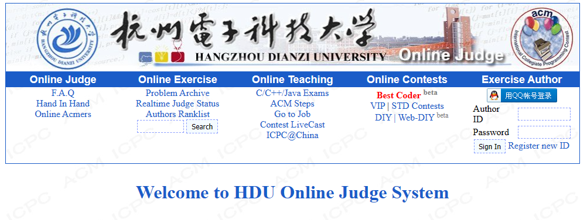
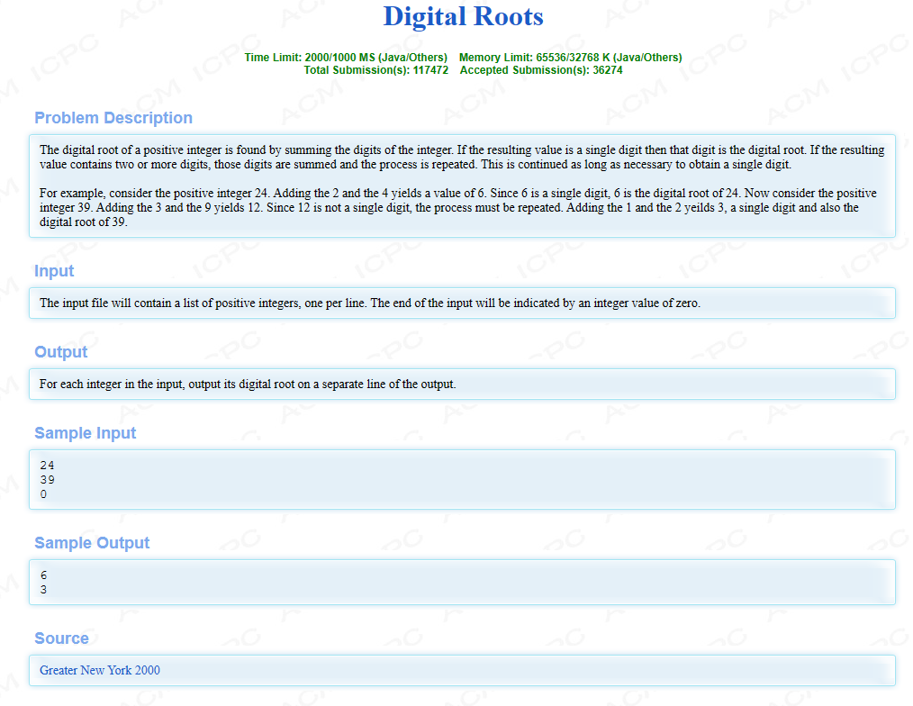
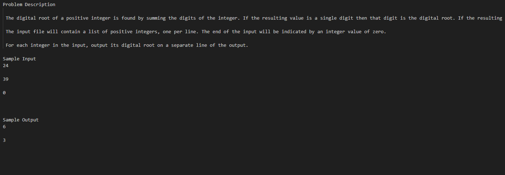

<div align="center">
  
</div>

<h1 align="center">用 Python 爬下杭电 OJ 部分题目</h1>

昨天在暑期实训的时候刚好介绍了使用 Python 来爬取部分学校的研究生官网的报录文件，头一次感受到 Python 的魅力，于是刚好看到杜学长的博客文章有思路实现，想着复刻个爬虫爬取 OJ 的题目（某些 OJ 网络不稳定，爬取下来方便刷题）

<!-- code_chunk_output -->

- [环境配置](#环境配置)
- [库介绍](#库介绍)
- [如何使用](#如何使用)
- [结果展示](#结果展示)
- [未来计划](#未来计划)
- [致谢](#致谢)

<!-- /code_chunk_output -->


## 环境配置
- Python 3.8.10
- pip 21.1.1

## 库介绍

|                                                             | 基本作用                                             |
| ----------------------------------------------------------- | ---------------------------------------------------- |
| webbrowser                                                  | 伪装成浏览器发送请求, 可以避免类似获取需要 js 的情况 |
| [urllib](https://www.runoob.com/python3/python-urllib.html) | 操作网站 url，对网站内容实现抓取                     |
| requests                                                    | 这里应用于改 request 的头，模拟成浏览器              |
| re                                                          | 正则匹配过滤                                         |


## 如何使用

0. 设置镜像源
```python
pip config set global.index-url https://pypi.tuna.tsinghua.edu.cn/simple
```

1. 安装依赖
```python
pip install requests
```

```python
pip install requests
```

3. 在 `main.py` 中直接点击运行即可在 `hdu题库` 目录 找到几千份 `txt` 文件

## 结果展示


<table width="100%" cellspacing="0" cellpadding="0">
  <tr align="center" valign="middle">
    <td width="50%">
      
    </td>
    <td width="50%">
      
    </td>
  </tr>
</table>


## 未来计划

- [X] 实现 `txt` 文件分开保存每个题目
- [ ] 处理为 `csv` 格式文件，方便保存在 `Excel` 中，以便后续支持写入数据库
- [ ] 支持各大 OJ 网站爬取

## 致谢

感谢 [@edxuanlen](https://github.com/edxuanlen) 的博客文章提供的技术支持
[喜欢博客的可以点击这里🤩](https://blog.csdn.net/edxuanlen/article/details/80252135?spm=1001.2014.3001.5502)
